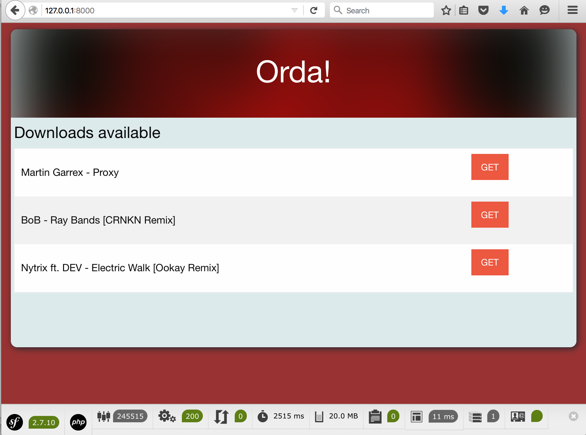
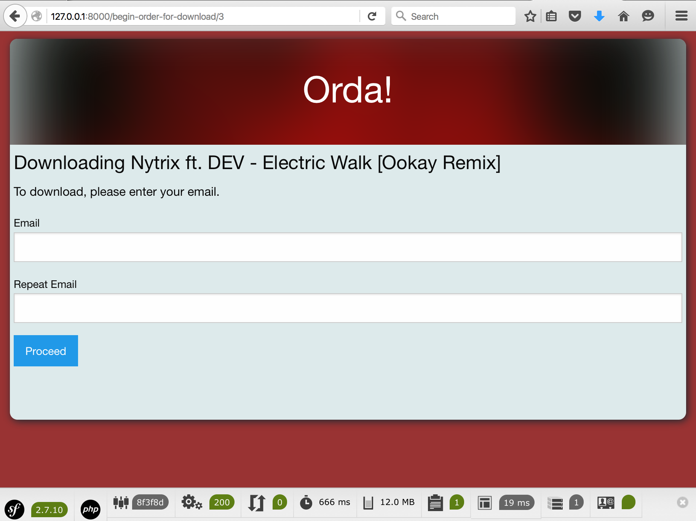
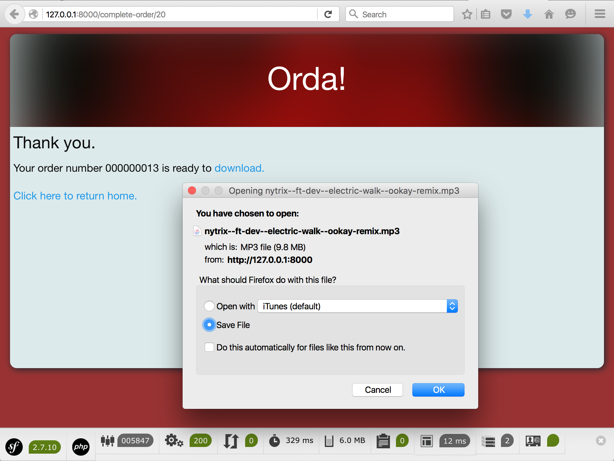
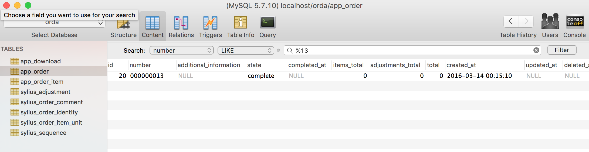

Orda!
=====

A project demonstrating the use of the Sylius OrderBundle
in a sample Symfony application.


Installation
------------

1. Clone this repository:

```bash
$ git clone https://github.com/adamelso/orda
```

2. Install packages with Composer:

```bash
$ cd orda
$ composer install
```


3. Create and populate the database with sample data:

```bash
$ php app/console doctrine:database:create 
$ php app/console doctrine:schema:create 
$ php app/console doctrine:fixtures:load 
```


4. Run the built-in PHP web server:

```bash
$ php app/console server:run 

Server running on http://127.0.0.1:8000

Quit the server with CONTROL-C.
```

5. When you access http://127.0.0.1:8000 you'll see a list of music tracks you can order.


Using the app
-------------

1. Choose a track




2. Enter your email (don't worry, your hosting this app and it doesn't send emails).




3. You'll be redirected to the download page where you can see your order number and download your song.




4. To confirm this, you can see the orders the database.


